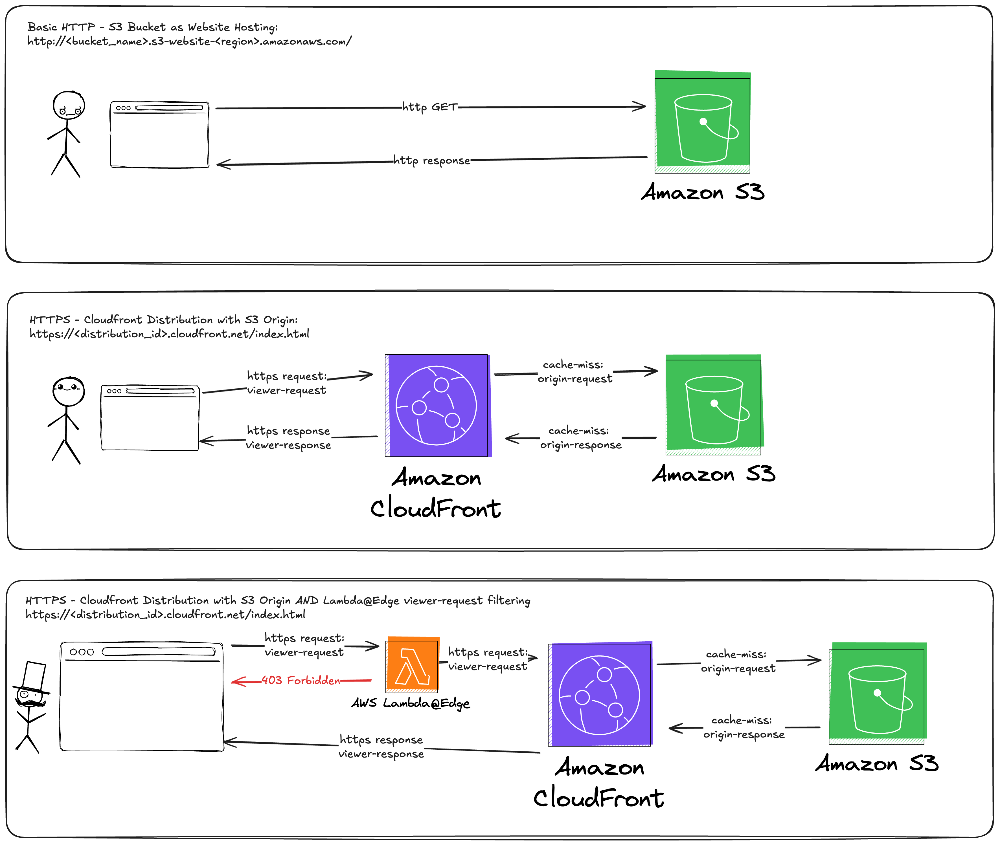

# The Toolshed

Collection of my personal terraform practices and modules so I need to reinvent less wheels.

## Public Asset Hosting - 3 Flavours



<!--TOC-->

<!--TOC-->

# Quickstart

## tl;dr

```sh
export AWS_PROFILE=389956346255_play_dev_tf
export AWS_ROLE="arn:aws:iam::<aws_account_id>:role/github-actions-oidc-<aws_account_id>-Role-<random_id>"
# aws sts get-caller-identity --profile $AWS_PROFILE --query Account --output text
eval "$(aws configure export-credentials --format env --profile $AWS_PROFILE)"
```

```sh
creds=$(aws sts assume-role \
  --role-arn "${AWS_ROLE}" \
  --role-session-name "TerraformCLIUsage" \
  --duration-seconds 3600 \
  --profile $AWS_PROFILE)
export AWS_ACCESS_KEY_ID=$(echo $creds | jq -r '.Credentials.AccessKeyId')
export AWS_SECRET_ACCESS_KEY=$(echo $creds | jq -r '.Credentials.SecretAccessKey')
export AWS_SESSION_TOKEN=$(echo $creds | jq -r '.Credentials.SessionToken')
export AWS_CREDENTIAL_EXPIRATION=$(echo $creds | jq -r '.Credentials.Expiration')
env | grep AWS
```

```sh
uv run scripts/tf-stack.py validate
uv run scripts/tf-stack.py create <your_stack_name>
uv run scripts/tf-stack.py gha-check --fix

```

## AWS CLI

<details> 

<summary><i>Expand this for dev configuration details.</i></summary>

## Pre-requisites

- [terraform](https://developer.hashicorp.com/terraform/tutorials/aws-get-started/install-cli#install-terraform)
- [aws cli](https://docs.aws.amazon.com/cli/latest/userguide/getting-started-install.html#getting-started-install-instructions)

You will want to setup your aws cli sso like so:

```sh
aws configure sso --profile "<company>_<env>_<account_id>_<role>"
```

The `AWS_PROFILE` name should follow the convention `<company>_<env>_<account_id>_<role>`.

> **NOTE:** 🚨 Try to avoid setting a `[default]` in your `~/.aws/credentials`. 🚨
>
> This will force you to use `--profile` and be explicit with **what actions** are applied on **what accounts**. (Yes this comes from _experience_ 🫠 ).
> You can however `export AWS_PROFILE=<project>_DEV_<aws_account_id>_Developer` so all commands will set the `--profile` automatically.

With the following values:

```sh
SSO session name (Recommended): <project>_DEV_<aws_account_id>_Developer_Session
SSO start URL [None]: https://<sso_domain>.awsapps.com/start/#
SSO region [None]: ap-southeast-2
SSO registration scopes [sso:account:access]:
...
CLI default client Region [None]: ap-southeast-2
CLI default output format [None]: json
```

Then to reauthenticate simply run:

```sh
aws sso login --profile <project>_DEV_<aws_account_id>_Developer
# SSO Login does not export environment variables needed for Terraform
eval "$(aws configure export-credentials --format env)"
```

</details>    
 
 <details> 

<summary><i>Expand this for full administrator speed run configuration.</i></summary>

- Copy the below mega-snippet into `~/.aws/config`
- `export AWS_PROFILE=<project>_<env>_<account_id>_<role>`
- `aws sso login`
- `aws sts get-caller-identity --profile $AWS_PROFILE --query Account --output text`
- `eval "$(aws configure export-credentials --format env --profile $AWS_PROFILE)"`

When you perform `aws sso login`:
- It looks in the `~/.aws/sso/cache` and `~/.aws/cli/cache` caches trying to match a json file with a name that is a `SHA1` hash of either the `profile.sso_session` or the `sso_session.sso_start_url` values.
    - _Cache-Miss_: Open a browser an authenticate
    - _Cache-Hit_: Use AccessToken

```ini
[profile <Project>_<Env>_<AccountID>_<Role>]
sso_session = <Project>_<Env>_<AccountID>_<Role>_Session
sso_account_id = <AccountID>
sso_role_name = <sso_role_name>
region = ap-southeast-2
output = json
[sso-session <Project>_<Env>_<AccountID>_<Role>_Session]
sso_start_url = https://<sso_domain>.awsapps.com/start/#
sso_region = ap-southeast-2
sso_registration_scopes = sso:account:access
```
</details>

 ----

# Overview

There are two parts to this platform component:
- Modules
- Implementations

## Modules

All platform components should be refactored as much as possible to Terraform modules.

## Implementations

The folder structure follows:

```
stacks/<stack_name>/*.tf
stacks/<stack_name>/backends/<env>.config
```

eg:

```
terraform/
├── README.md
├── bootstrap
├── modules
│   ├── gooddata_frontend_assets
│   └── landing_bucket
├── stacks
│   ├── gooddata_frontend_assets
│   │   ├── backends
│   │   │   ├── dev.config
│   │   │   ├── prod.config
│   │   │   └── test.config
│   │   ├── backend.tf
│   │   ├── main.tf
│   │   ├── provider.tf
│   │   └── variables.tf
│   └── landing_buckets
│       ├── backends
│       │   ├── dev.config
│       │   ├── prod.config
│       │   └── test.config
│       ├── backend.tf
│       ├── landing_buckets.yml
│       ├── main.tf
│       ├── provider.tf
│       └── variables.tf
├── tf.py
└── README.md
```

If you haven't read the above sections about `aws` CLI (you should), then you'll atleast want to know that `terraform` won't access your `~/.aws/` credential cache. You need to export the credentials to environment variables explicitly:
```sh
export AWS_PROFILE=<project>_<env>_<account_id>_<role>
aws sso login
eval "$(aws configure export-credentials --format env --profile $AWS_PROFILE)"
```

Then you can run commands like as follows:

```sh
terraform -chdir=stacks/<stack_name>/ init -backend-config=./backends/<env>.config -reconfigure
terraform -chdir=stacks/<stack_name>/ plan -var environment=<env>
terraform -chdir=stacks/<stack_name>/ apply -var environment=<env>
```
## Terraform Statefile Management

- There are 3 environments (AWS Accounts)
- There is one S3 bucket in each account for managing terraform statefiles
- There is one DynamoDB LockTable per account
  - Each bucket **can have many keys** 
  - Each lock table **can have many keys** 
  - These **keys** have the `<stack_name>` in the keypath.
- Stacks are independent of each other.

Checkout each of the `stacks/<stack_name>/backends/<env>.config`:

```hcl
bucket = "terraform-state-<account_id>" 
key = "<project>/<env>/<stack_name>/terraform.tfstate" 
region = "ap-southeast-2" 
dynamodb_table = "terraform-state-<account_id>" 
encrypt = true 
```

This is why we have to `-chdir` so parts of our platform can have statefiles that are in isolation of each other and not getting polluted by unrelated infra noise.

## Adding a new stack

When creating a new stack there are a couple of steps:

### Adding Stack Backends

```sh
uv run scripts/tf-stack.py create <your_stack_name>
```

Output:
```sh
Creating stack: your_stack_name
Creating folder structure in: stacks/your_stack_name
    Copying scripts/templates/main.tf --> stacks/your_stack_name/main.tf
    Copying scripts/templates/variables.tf --> stacks/your_stack_name/variables.tf
    Copying scripts/templates/provider.tf --> stacks/your_stack_name/provider.tf
    Copying scripts/templates/backend.tf --> stacks/your_stack_name/backend.tf
Creating backend config for: your_stack_name
Reading base config from config.yml
    Creating backend config for: dev
    Writing backend config to stacks/your_stack_name/backends/dev.config
    Creating backend config for: test
    Writing backend config to stacks/your_stack_name/backends/test.config
    Creating backend config for: prod
    Writing backend config to stacks/your_stack_name/backends/prod.config
Creating README.md for: your_stack_name
Stack your_stack_name created successfully ✅
```

Should output:

```sh
stacks/your_stack_name
├── README.md
├── backend.tf
├── backends
│   ├── dev.config
│   ├── prod.config
│   └── test.config
├── main.tf
├── provider.tf
└── variables.tf
```

Quickstart Steps:

```sh
terraform -chdir=stacks/your_stack_name/ init -backend-config=./backends/<env>.config -reconfigure
terraform -chdir=stacks/your_stack_name/ plan -var environment=<env>
terraform -chdir=stacks/your_stack_name/ apply -var environment=<env>
```

### Updating Github Actions

When creating a new stack you'll need to update the `tf-per-stack.strategy.matrix.stack` property:

```sh
uv run scripts/tf-stacks.py gha-check --fix
```

`.github/workflows/terraform-cicd-parent.yml`

```terraform
jobs:
  # ...
  tf-per-stack:
    needs:
      - backend-validate
      - tf-format-check
    # Central Spot to iterate over all stacks
    strategy:
      matrix:
        stack: [secure_s3_bucket, frontend_assets, <your stack here>]
    uses: ./.github/workflows/terraform-cicd-per-stack.yml
    with:
      stack: ${{ matrix.stack }}
      target_env: ${{ inputs.environment }}
    secrets: inherit
```

  